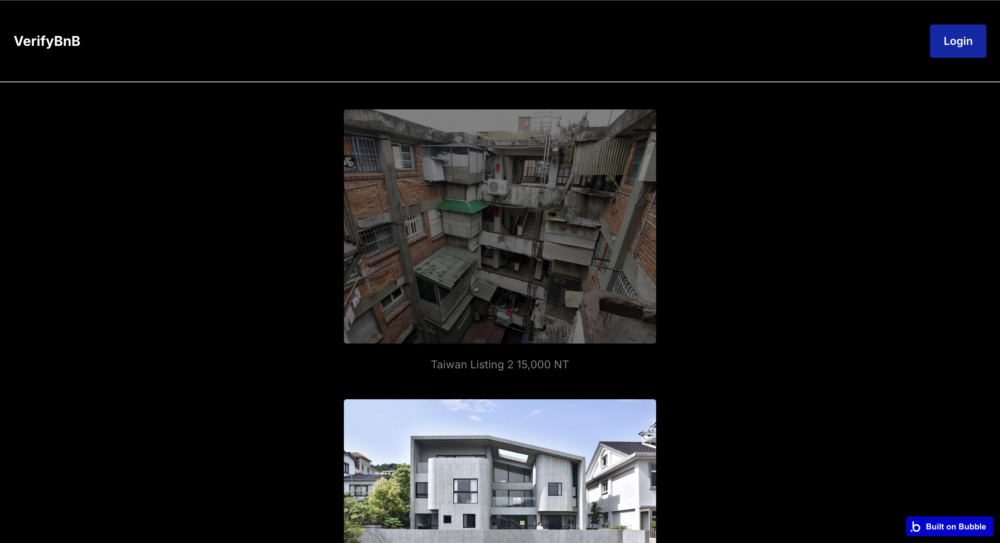
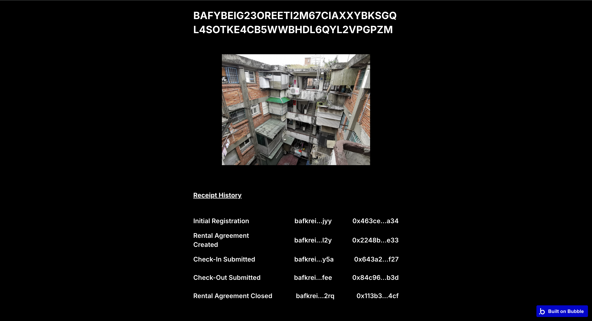

# VerifyBnB - Student Housing Rental Receipts

> Blockchain-verified receipts for student housing move-in/move-out inspections

**🏆 RealFi Hack 2025 Submission**  
**Challenge:** Proof Your Rental Receipt

---

## 🎯 Problem

Students lose millions in security deposits annually due to unfair damage claims. Without timestamped, immutable proof of apartment condition at move-in, landlords can claim pre-existing damage was caused by the tenant.

## 💡 Solution

DormProof creates **blockchain-verified receipts** for rental inspections:
- Students upload photos at move-in and move-out
- Each event is recorded as an **ERC-7053 commit** on Numbers Protocol
- Creates immutable, timestamped proof that protects both parties
- Anyone can verify receipts on the blockchain

## 🏗️ Architecture
```
┌─────────────────────────┐
│   Bubble.io App         │  ← No-code frontend
│   • Property listings   │  • ProofSnap Photos
│   • Booking forms       │  • Receipt timeline
└───────────┬─────────────┘
            │ API calls via API Connector
            ↓
┌─────────────────────────┐
│   Numbers Protocol      │  ← Capture API
│   • ERC-7053 commits    │  • Asset registration
│   • Blockchain storage  │  • Nid generation
└───────────┬─────────────┘
            │ Writes to
            ↓
┌─────────────────────────┐
│   Numbers Mainnet       │  ← Immutable storage
│   • Permanent records   │  Public verification
└─────────────────────────┘
```

## 🚀 Live Demo

**App:** [https://2025-hackathon.bubbleapps.io/version-test/](https://2025-hackathon.bubbleapps.io/version-test/)  

### Prerequisites
Need to have a Capture Account. Can create one via the [Capture Dashboard](https://dashboard.captureapp.xyz/main) platform.

### Try It Yourself:
1. Visit the live app
2. Login into Capture Account
3. Click on Listing
4. Sync ProofSnap Photos
5. View receipt with on-chain commits

## 📸 Screenshots

### Property Listings



### Receipt Timeline



## 🔗 Blockchain Receipts

### Event Types:
1. **Initial Registration** - Property Listing Created
2. **Rental Agreement Created** - Rental Agreement Created
3. **Check-In Submitted** - Move-In photos stored on-chain
4. **Check-Out Submitted** - Move-Out initiated. Initiate Review.
5. **Rental Agreement Closed** - Review Completed. Rental Agreement Closed

### Example On-Chain Commit:
```json
{
  "assetCid": "bafybeig23oreeti2m67ciaxxybksgql4sotke4cb5wwbhdl6qyl2vpgpzm",
  "assetSha256": "53e962a01171d366701e1fec3b8990927673c75d92402ce7f6a6c6b117e9759a",
  "encodingFormat": "image/jpeg",
  "assetTimestampCreated": "1642521600",
  "assetCreator": "hinoki-inc",
  "message": "check-in submitted",
  "check_in_items": [
    "bafkreiaubgs4doqkxxgankmdeo2akwuwt6hh2pyzkn22bkoh6o52hgfidm",
    "bafybeigi44ybi7ncseige6pti6yvnrbqaf4ruj62mez4ctyk743jdhgsw4"
  ]
}
```

## 🛠️ Technical Stack

- **Frontend:** Bubble.io (no-code platform)
- **Blockchain:** Numbers Protocol (Avalanche Subnet)
- **Standard:** ERC-7053 commits
- **API:** Numbers Protocol Capture API
- **Integration:** Bubble API Connector

### No Installation Required!
This is a no-code application. To run:
- Visit the live Bubble.io app (link above)
- Or watch the demo video

## 💰 Market Opportunity

- **Target:** 20+ million college students in US
- **Problem Size:** Billions in disputed security deposits annually
- **Average Deposit:** $500-1500 per student
- **Potential Impact:** Protect vulnerable population from predatory practices

## 🚀 Future Enhancements

- Multi-signature receipts (landlord + tenant co-sign)
- Renter Dashboard
- Integration with property management systems
- Automated deposit escrow with smart contracts
- Insurance company API for risk assessment
- Dispute resolution workflow

## 📄 License

MIT

## 🙏 Acknowledgments

Built for RealFi Hack 2025 using Numbers Protocol's Capture API.

---

**Questions?** Open an issue or contact [your email]